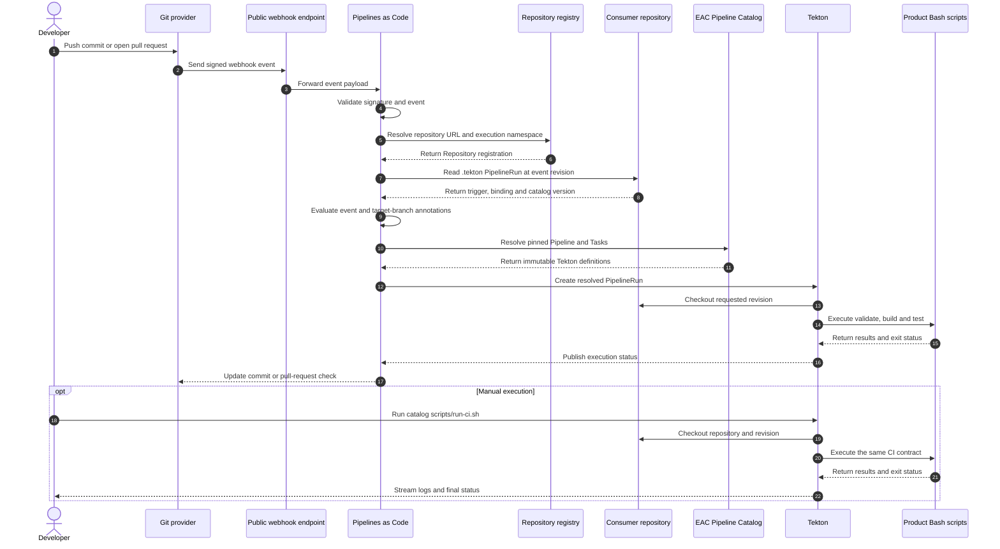
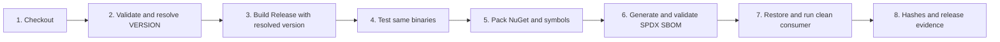
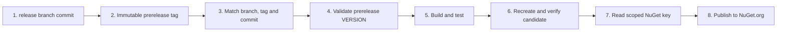

# EAC Pipeline Catalog

## 1. Propósito

Proporcionar pipelines reutilizables y versionadas para distintos tipos de
producto sin copiar la orquestación Tekton en cada repositorio.

Las Pipelines implementan el
[lineamiento transversal de ramas y releases](../../../governance/eac-engineering-governance/docs/standards/delivery/BRANCHING_AND_RELEASE_STANDARD.md);
no definen una estrategia de ramas independiente.

El catálogo no sustituye los scripts del producto. Cada repositorio conserva
sus comandos Bash, reglas, código, pruebas y configuración. El catálogo solo
orquesta contratos conocidos.

## 2. Identidad y límites

| Elemento | Decisión |
|---|---|
| repositorio | `eac-pipeline-catalog` |
| entregable | catálogo Tekton versionado |
| versión inicial | `0.1.0` |
| versión en preparación | `0.2.0` |
| propietario | EAC Platform |
| consumidores | plataforma, herramientas, soluciones, servicios y cualquier repositorio compatible |
| excluido | lógica de negocio, instalación de terceros y secretos |

Una versión del catálogo contiene varios perfiles. No se crea un repositorio
por pipeline ni se publica un NuGet para envolver Tekton.

## 3. Modelo de reutilización



### Orden explicado

1. El desarrollador publica un commit o abre un pull request.
2. El proveedor Git envía inmediatamente un webhook firmado; no existe
   sondeo periódico del repositorio.
3. En local, el endpoint público reenvía el evento mediante `gosmee`; en una
   plataforma desplegada esta responsabilidad pertenece al Route o Ingress.
4. Pipelines as Code valida la firma usando el secreto del webhook y las
   credenciales de la aplicación del proveedor.
5. La URL incluida en el evento debe coincidir con un recurso `Repository`.
6. Ese recurso selecciona el namespace donde se creará el `PipelineRun`.
7. Pipelines as Code lee `.tekton/continuous-integration.yaml` en la revisión
   exacta que originó el evento.
8. El archivo consumidor aporta solamente trigger, binding, workspace y la
   versión inmutable del catálogo.
9. Las anotaciones determinan si el evento y la rama deben ejecutar CI.
10. Pipelines as Code obtiene la Pipeline y las Tasks fijadas por versión.
11. Las definiciones remotas se incorporan al `PipelineRun` resuelto.
12. Tekton crea la ejecución dentro del namespace registrado.
13. La primera Task obtiene el repositorio y resuelve el commit solicitado.
14. Las siguientes Tasks invocan los scripts Bash del producto.
15. Los scripts devuelven resultados pequeños y un código de salida.
16. Tekton conserva estado, duración, logs y Results.
17. Pipelines as Code publica el estado de la ejecución.
18. El proveedor Git muestra el check en el commit o pull request.

La ruta manual comienza en el paso 19 del diagrama. `scripts/run-ci.sh` crea
directamente el `PipelineRun`, por lo que no intervienen el proveedor Git, la
GitHub App, el webhook, `gosmee`, Pipelines as Code ni el recurso `Repository`.
Desde el checkout en adelante utiliza el mismo contrato de CI.

### Elementos del enlace con el repositorio

| Elemento | Responsabilidad | Ubicación |
|---|---|---|
| GitHub App | suscribirse a eventos y operar checks con permisos mínimos | organización GitHub |
| instalación de la App | conceder acceso a los repositorios seleccionados | organización GitHub |
| webhook URL | recibir los eventos enviados por GitHub | endpoint público |
| webhook secret | verificar que el evento fue firmado por GitHub | Secret del namespace de Pipelines as Code |
| App ID y private key | autenticar Pipelines as Code ante la API de GitHub | Secret del namespace de Pipelines as Code |
| `Repository` | asociar una URL Git con el namespace de ejecución | clúster Tekton |
| `.tekton/*.yaml` | declarar el trigger y enlazar el repositorio con un perfil | repositorio consumidor |
| catálogo | proporcionar Pipeline y Tasks versionadas | `eac-pipeline-catalog` |

La App no ejecuta Tekton y el recurso `Repository` no escucha GitHub. La App
y el webhook transportan el evento; Pipelines as Code lo procesa; `Repository`
autoriza el mapeo URL-namespace; finalmente Tekton ejecuta el `PipelineRun`.

## 4. Plantilla, binding y trigger

| Concepto | Implementación |
|---|---|
| plantilla | `Pipeline` remota y versionada del catálogo |
| binding | parámetros y workspaces del `PipelineRun` consumidor |
| trigger | anotaciones `pipelinesascode.tekton.dev/on-event` y `on-target-branch` |
| ejecución | `PipelineRun` creado por Pipelines as Code |

No se añaden `EventListener`, `TriggerBinding` ni `TriggerTemplate` de Tekton
Triggers. Pipelines as Code ya recibe, valida y enlaza los eventos Git; usar
ambos mecanismos duplicaría webhooks, filtros y mantenimiento.

## 5. Estructura y perfiles

```text
catalog/
├── shared/
│   └── tasks/                         # comportamiento transversal real
└── profiles/
    ├── packages/
    │   ├── nuget/                     # implementado
    │   │   ├── tasks/
    │   │   └── pipelines/
    │   └── npm/                       # se crea al implementar el perfil
    ├── applications/
    │   └── angular/                   # se crea al implementar el perfil
    ├── services/
    │   └── dotnet/                    # se crea al implementar el perfil
    └── deployments/                   # se crea al implementar el perfil
```

La primera clasificación expresa la naturaleza del entregable: package,
aplicación, servicio o deployment. El segundo nivel identifica su formato o
tecnología. Las carpetas pendientes no se crean vacías.

| Perfil | Artefacto objetivo | CI | Release | Estado |
|---|---|---:|---:|---|
| `packages/nuget` | `.nupkg`, `.snupkg`, SBOM y evidencia | sí | candidato y prerelease implementados | implementado |
| `packages/npm` | paquete npm | planificado | planificado | pendiente |
| `applications/angular` | aplicación web estática o imagen OCI | planificado | planificado | pendiente |
| `services/dotnet` | imagen OCI de API, worker o gateway | planificado | planificado | pendiente |
| `deployments` | promoción por digest | no aplica | planificado | pendiente |

Los perfiles comparten Tasks únicamente cuando el comportamiento y el
contrato son idénticos. No se crea una pipeline universal con condicionales
para tecnologías diferentes.

## 6. Contrato `nuget-ci`

El repositorio consumidor debe exponer:

```text
scripts/
├── validate.sh
├── build.sh
├── test.sh
└── ci.sh
```

La Pipeline ejecuta:

```text
checkout → validate → build → test --no-build
```

| Parámetro | Uso |
|---|---|
| `repo-url` | repositorio que se debe obtener |
| `revision` | commit, tag o rama que se debe resolver |
| `configuration` | configuración .NET, `Release` por defecto |

El catálogo fija las imágenes de ejecución y la política de seguridad. El
repositorio mantiene el contenido de los scripts, por lo que puede evolucionar
sus reglas sin modificar la Pipeline compartida.

## 7. Contrato `nuget-release-candidate`

El repositorio consumidor amplía el contrato de CI con:

```text
VERSION
.config/
└── dotnet-tools.json
scripts/
├── pack.sh
└── release-candidate.sh
```



### Orden explicado

1. Se obtiene la revisión solicitada y se registra su commit inmutable.
2. Se aplican las mismas reglas de alcance y gobierno que en CI.
3. La Task de validación lee `VERSION`; actualmente solo acepta versiones
   `alpha.N` o `beta.N`, y entrega ese resultado a MSBuild sin modificar el
   proyecto.
4. Las pruebas utilizan exactamente los binaries compilados en el paso 3.
5. Se generan un `.nupkg` y un `.snupkg` sin recompilar.
6. Microsoft SBOM Tool, fijado por el repositorio, genera y valida SPDX 2.2.
7. Un proyecto temporal restaura el package desde el directorio local y usa
   una API pública real del ensamblado.
8. Se generan SHA-256 y evidencia JSON vinculados al commit y la versión.

| Parámetro | Uso |
|---|---|
| `repo-url` | repositorio que se debe obtener |
| `revision` | commit, tag o rama que se debe resolver |

La versión no es un parámetro libre de la Pipeline. Pertenece al commit que se
está construyendo y se resuelve desde su archivo `VERSION`.

El candidato no se publica y no recibe credenciales. Sirve como evidencia del
pull request antes de su aprobación.

## 8. Contrato `nuget-prerelease-publication`



### Orden explicado

1. La consola selecciona el commit inmutable de una rama `release/*` sincronizada.
2. La consola crea y publica el tag `v<versión>` sobre ese mismo commit.
3. Tekton consulta el remoto y exige que commit, rama y tag coincidan.
4. La versión pertenece al commit y debe usar `alpha.N`, `beta.N` o `rc.N`.
5. Se repiten build y pruebas en la ejecución que publicará; no se confía ciegamente en
   una ejecución anterior.
6. Se regeneran package, símbolos, SBOM, smoke test, hashes y evidencia en el
   mismo `PipelineRun` que publicará.
7. Solo la Task final proyecta la clave `nuget-api-key` del Secret
   `eac-release-publishing`.
8. `dotnet nuget push` publica en NuGet.org con `--skip-duplicate`; ninguna
   clave aparece como parámetro, resultado o log.

La Pipeline no publica durante el CI ordinario. Se invoca explícitamente desde
la rama de estabilización y conserva una ServiceAccount de release separada de
CI. `main` queda reservado para el merge de la versión final aprobada.

## 9. Versionado

- el catálogo usa SemVer;
- cada producto declara su versión preliminar en un archivo `VERSION`;
- los perfiles de candidato no inventan ni sobrescriben esa versión;
- mientras el producto esté en desarrollo inicial se admiten únicamente
  sufijos `alpha.N` o `beta.N`;
- los consumidores fijan una etiqueta inmutable, por ejemplo `v0.1.0`;
- no se permiten referencias a `main`, `latest` ni tags móviles desde CI;
- una corrección compatible genera una nueva versión del catálogo;
- un cambio incompatible crea una nueva versión mayor del perfil;
- cada `PipelineRun` conserva la especificación resuelta para auditoría.

## 10. Modos de consumo

### Pipelines as Code

El consumidor conserva solo un archivo pequeño bajo `.tekton/`. Este contiene
el trigger, los parámetros dinámicos, el workspace y la referencia remota.

### Ejecución manual

`scripts/install.sh` aplica el catálogo seleccionado al namespace. Después se
puede iniciar la Pipeline mediante `scripts/run-ci.sh <repository-url>
[revision]`. El script crea el workspace efímero, aplica el contexto de
seguridad, muestra los logs y propaga el resultado de la ejecución. Este modo
permite pruebas locales sin depender de un evento Git y no añade archivos al
repositorio consumidor.

Para generar un candidato se utiliza
`scripts/run-release-candidate.sh <repository-url> [revision]`. La
ejecución usa `eac-release`, pero no proyecta ningún Secret mientras el perfil
no contenga una Task de publicación.

Los perfiles de candidato y publicación utilizan un solo PVC efímero por
`PipelineRun`. `source`, la caché de dependencias y `artifacts` son
subdirectorios del mismo volumen; la Task de publicación recibe únicamente el
subdirectorio `artifacts` mediante `subPath`. Esta regla evita enlazar varios
PVC escribibles a una misma `TaskRun` y mantiene la portabilidad entre modos de
`coschedule` de Tekton.

Para publicar se utiliza `scripts/run-prerelease-publication.sh` con la URL,
el SHA, la rama `release/*` y el tag prerelease. La Pipeline verifica nuevamente
los tres valores remotos antes de que la Task con credenciales pueda ejecutarse.

### Limpieza local

`scripts/clean.sh --confirm` restablece el namespace de ejecución eliminando
las definiciones Tekton, sus ejecuciones, los PVC efímeros y los registros de
repositorios de Pipelines as Code. No desinstala los controladores, no elimina
credenciales y no modifica las Service Accounts de la plataforma.

## 11. Seguridad

- las Tasks se ejecutan sin privilegios y eliminan capabilities Linux;
- CI no recibe credenciales de publicación;
- los parámetros no contienen secretos;
- las revisiones del catálogo son inmutables;
- los scripts del pull request se consideran código no confiable;
- release y deployment utilizarán Service Accounts distintas de CI.
