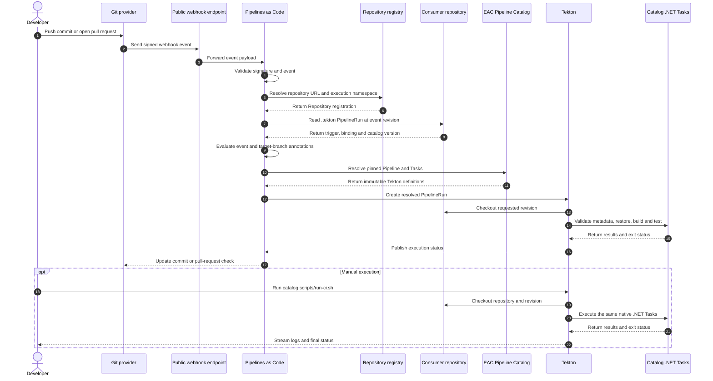

```mermaid
flowchart LR
    CHECKOUT[1. Checkout] --> VALIDATE[2. Validate and resolve VERSION]
    VALIDATE --> BUILD[3. Build Release with resolved version]
    BUILD --> TEST[4. Test same binaries]
    TEST --> PACK[5. Pack NuGet and symbols]
    PACK --> NORMALIZE[6. Normalize package bytes from commit time]
    NORMALIZE --> SBOM[7. Generate, normalize and validate SPDX SBOM]
    SBOM --> SMOKE[8. Restore and run clean consumer]
    SMOKE --> EVIDENCE[9. Hashes and release evidence]
```

# EAC Pipeline Catalog

## 1. Propósito

Proporcionar pipelines reutilizables y versionadas para distintos tipos de
producto sin copiar la orquestación Tekton en cada repositorio.

Las Pipelines implementan el
[lineamiento transversal de ramas y releases](../../../governance/eac-engineering-governance/docs/standards/delivery/BRANCHING_AND_RELEASE_STANDARD.md);
no definen una estrategia de ramas independiente.

El catálogo implementa las operaciones de CI y publicación por tipo de
artefacto. Cada repositorio conserva código, pruebas, configuración declarativa
y scripts auxiliares para uso local; Tekton no ejecuta esos scripts.

## 2. Identidad y límites

| Elemento | Decisión |
|---|---|
| repositorio | `eac-pipeline-catalog` |
| entregable | catálogo Tekton versionado |
| versión inicial | `0.1.0` |
| versión en preparación | `0.4.10` |
| propietario | EAC Platform |
| consumidores | plataforma, herramientas, soluciones, servicios y cualquier repositorio compatible |
| excluido | lógica de negocio, instalación de terceros y secretos |

Una versión del catálogo contiene varios perfiles. No se crea un repositorio
por pipeline ni se publica un NuGet para envolver Tekton.

## 3. Modelo de reutilización



### Orden explicado

1. El desarrollador publica un commit o abre un pull request.
2. El proveedor Git envía inmediatamente un webhook firmado; no existe
   sondeo periódico del repositorio.
3. En local, el endpoint público reenvía el evento mediante `gosmee`; en una
   plataforma desplegada esta responsabilidad pertenece al Route o Ingress.
4. Pipelines as Code valida la firma usando el secreto del webhook y las
   credenciales de la aplicación del proveedor.
5. La URL incluida en el evento debe coincidir con un recurso `Repository`.
6. Ese recurso selecciona el namespace donde se creará el `PipelineRun`.
7. Pipelines as Code lee `.tekton/continuous-integration.yaml` en la revisión
   exacta que originó el evento.
8. El archivo consumidor aporta solamente trigger, binding, workspace y la
   versión inmutable del catálogo.
9. Las anotaciones determinan si el evento y la rama deben ejecutar CI.
10. Pipelines as Code obtiene la Pipeline y las Tasks fijadas por versión.
11. Las definiciones remotas se incorporan al `PipelineRun` resuelto.
12. Tekton crea la ejecución dentro del namespace registrado.
13. La primera Task obtiene el repositorio y resuelve el commit solicitado.
14. Las siguientes Tasks ejecutan directamente el contrato .NET del perfil.
15. Las Tasks devuelven resultados pequeños y un código de salida.
16. Tekton conserva estado, duración, logs y Results.
17. Pipelines as Code publica el estado de la ejecución.
18. El proveedor Git muestra el check en el commit o pull request.

La ruta manual comienza en el paso 19 del diagrama. `scripts/run-ci.sh` crea
directamente el `PipelineRun`, por lo que no intervienen el proveedor Git, la
GitHub App, el webhook, `gosmee`, Pipelines as Code ni el recurso `Repository`.
Desde el checkout en adelante utiliza el mismo contrato de CI.

### Elementos del enlace con el repositorio

| Elemento | Responsabilidad | Ubicación |
|---|---|---|
| GitHub App | suscribirse a eventos y operar checks con permisos mínimos | organización GitHub |
| instalación de la App | conceder acceso a todos los repositorios actuales y futuros del workspace mediante `All repositories` | organización GitHub |
| webhook URL | recibir los eventos enviados por GitHub | endpoint público |
| webhook secret | verificar que el evento fue firmado por GitHub | Secret del namespace de Pipelines as Code |
| App ID y private key | autenticar Pipelines as Code ante la API de GitHub | Secret del namespace de Pipelines as Code |
| `Repository` | asociar una URL Git con el namespace de ejecución | clúster Tekton |
| `.tekton/*.yaml` | declarar el trigger y enlazar el repositorio con un perfil | repositorio consumidor |
| credencial Git de lectura | obtener repositorios privados y contrastar rama/tag remotos sin exponer tokens en la Pipeline | Secret opcional montado exclusivamente en checkout y compuerta de revisión de release |
| catálogo | proporcionar Pipeline y Tasks versionadas | `eac-pipeline-catalog` |

La App no ejecuta Tekton y el recurso `Repository` no escucha GitHub. La App
y el webhook transportan el evento; Pipelines as Code lo procesa; `Repository`
autoriza el mapeo URL-namespace; finalmente Tekton ejecuta el `PipelineRun`.
El acceso organizacional de la App no habilita por sí solo un pipeline: cada
repositorio debe mantener su binding `.tekton` y su recurso `Repository`
declarativo en el namespace gobernado.

La credencial de checkout es independiente de la GitHub App de Pipelines as
Code: la App recibe eventos y actualiza checks; el Secret Git autoriza el
`fetch` y los `ls-remote` de integridad que ejecuta Tekton. Sólo las Tasks de
checkout y compuerta de revisión de release montan el Secret como volumen
opcional y construyen allí la configuración Git efímera. Fijan
`HOME=/tekton/home`, no reciben usuario o token como parámetros y funcionan
igual para una URL HTTPS pública o privada. Validación de producto, build,
pruebas y publicación del paquete no reciben el Secret.

## 4. Plantilla, binding y trigger

| Concepto | Implementación |
|---|---|
| plantilla | `Pipeline` remota y versionada del catálogo |
| binding | parámetros y workspaces del `PipelineRun` consumidor |
| trigger | anotaciones `pipelinesascode.tekton.dev/on-event` y `on-target-branch` |
| ejecución | `PipelineRun` creado por Pipelines as Code |

No se añaden `EventListener`, `TriggerBinding` ni `TriggerTemplate` de Tekton
Triggers. Pipelines as Code ya recibe, valida y enlaza los eventos Git; usar
ambos mecanismos duplicaría webhooks, filtros y mantenimiento.

## 5. Estructura y perfiles

```text
catalog/
├── shared/
│   └── tasks/                         # comportamiento transversal real
└── profiles/
    ├── packages/
    │   ├── nuget/                     # implementado
    │   │   ├── tasks/
    │   │   └── pipelines/
    │   └── npm/                       # se crea al implementar el perfil
    ├── applications/
    │   └── angular/                   # se crea al implementar el perfil
    ├── services/
    │   └── dotnet/                    # se crea al implementar el perfil
    └── deployments/                   # se crea al implementar el perfil
```

La primera clasificación expresa la naturaleza del entregable: package,
aplicación, servicio o deployment. El segundo nivel identifica su formato o
tecnología. Las carpetas pendientes no se crean vacías.

| Perfil | Artefacto objetivo | CI | Release | Estado |
|---|---|---:|---:|---|
| `packages/nuget` | `.nupkg`, `.snupkg`, SBOM y evidencia | sí | candidato, prerelease y estable implementados | implementado |
| `packages/npm` | paquete npm | planificado | planificado | pendiente |
| `applications/angular` | aplicación web estática o imagen OCI | planificado | planificado | pendiente |
| `services/dotnet` | imagen OCI de API, worker o gateway | planificado | planificado | pendiente |
| `deployments` | promoción por digest | no aplica | planificado | pendiente |

Los perfiles comparten Tasks únicamente cuando el comportamiento y el
contrato son idénticos. No se crea una pipeline universal con condicionales
para tecnologías diferentes.

## 6. Contrato `nuget-ci`

El repositorio consumidor debe exponer:

```text
scripts/
├── validate.sh
├── build.sh
├── test.sh
└── ci.sh
```

La Pipeline ejecuta:

```text
checkout → validate → build → test --no-build
```

| Parámetro | Uso |
|---|---|
| `repo-url` | repositorio que se debe obtener |
| `revision` | commit, tag o rama que se debe resolver |
| `configuration` | configuración .NET, `Release` por defecto |

El catálogo fija las imágenes, la política de seguridad y las operaciones
`dotnet restore`, `format`, `build`, `test` y `pack`. El repositorio aporta solo
el contrato declarativo: una solución raíz, `VERSION`, `global.json`,
`NuGet.Config`, `.config/dotnet-tools.json` y un proyecto empaquetable bajo
`src`. Los scripts Bash locales son auxiliares para desarrollo y nunca son
invocados por Tekton. La validación también rechaza que un componente implemente
`Pipeline`, `Task` o `pipelineSpec`: `.tekton` es exclusivamente un binding.

### Integración Kafka opcional

Los adaptadores NuGet que necesitan verificar un broker real reutilizan las mismas
Pipelines NuGet y seleccionan `integration-profile: kafka` desde su catálogo de
consumo. CI, candidato y publicación prerelease aplican el mismo selector. La
ruta predeterminada ejecuta `eac-dotnet-test`; la ruta Kafka, mutuamente
excluyente, ejecuta `eac-dotnet-test-kafka`, aprovisiona un sidecar efímero no
privilegiado y expone `KAFKA_BOOTSTRAP_SERVERS` al proceso de pruebas. El
repositorio consumidor no define Pipelines, Tasks ni infraestructura Docker
propia.

### Integración PostgreSQL opcional

Los componentes NuGet que verifican persistencia relacional real seleccionan
`integration-profile: postgresql` en las mismas Pipelines de CI, candidato y
publicación prerelease. La ruta, mutuamente excluyente con `default` y `kafka`,
ejecuta `eac-dotnet-test-postgresql`, aprovisiona PostgreSQL como sidecar efímero
no privilegiado y entrega `EAC_POSTGRES_CONNECTION_STRING` a las pruebas. El
componente consumidor acepta esa conexión externa y conserva Testcontainers
únicamente como alternativa para la ejecución local.

### Integración MongoDB opcional

Los componentes NuGet que certifican persistencia documental seleccionan
`integration-profile: mongodb`. La Task reutilizable aprovisiona dos sidecars
no privilegiados de la misma versión fijada: una instancia standalone y un
replica set de un nodo. Expone `EAC_MONGODB_CONNECTION_STRING` para las reglas
documentales y `EAC_MONGODB_TRANSACTIONAL_CONNECTION_STRING` para las reglas
transaccionales. El consumidor conserva Testcontainers solo como alternativa
local y no incorpora Docker, Pipelines ni Tasks propias.

### Integración Elasticsearch opcional

Los adaptadores NuGet de búsqueda seleccionan `integration-profile:
elasticsearch` en las mismas Pipelines de CI, candidato y publicación
prerelease. La Task reutilizable inicia Elasticsearch 9.3.4 como sidecar
efímero no privilegiado y expone `EAC_ELASTICSEARCH_ENDPOINT` al proceso de
pruebas. El consumidor usa ese endpoint externo y conserva Testcontainers
solamente como alternativa local; no define Tasks, Pipelines ni recursos del
proveedor dentro de su repositorio.

Para CI, candidato y publicación prerelease, la Task de validación resuelve el
perfil efectivo desde el binding versionado
`.tekton/continuous-integration.yaml` del commit obtenido. El valor enviado por
el runner se conserva como alternativa para repositorios que todavía no tienen
binding. Cuando ambos difieren, prevalece el binding remoto y la ejecución deja
una advertencia explícita. Esto evita que una consola desactualizada degrade por
accidente un componente `kafka`, `postgresql`, `mongodb` o `elasticsearch` a la ruta `default`.

## 7. Contrato `nuget-release-candidate`

El repositorio consumidor amplía el contrato de CI con:

```text
VERSION
.config/
└── dotnet-tools.json
src/
└── <un proyecto con IsPackable=true>
```



### Orden explicado

1. Se obtiene la revisión solicitada y se registra su commit inmutable.
2. Se aplican las mismas reglas de alcance y gobierno que en CI.
3. La Task de validación lee `VERSION`; acepta versiones `alpha.N`, `beta.N`,
   `rc.N` o estables, y entrega ese resultado a MSBuild sin modificar el
   proyecto.
4. Las pruebas utilizan exactamente los binaries compilados en el paso 3.
5. Se generan un `.nupkg` y un `.snupkg` sin recompilar.
6. Se normalizan orden, marcas de tiempo y metadatos OPC de ambos ZIP usando
   la fecha del commit como `SOURCE_DATE_EPOCH` lógico.
7. Microsoft SBOM Tool, fijado por el repositorio, genera SPDX 2.2; después se
   normalizan sus campos dinámicos y se valida el resultado.
8. Un proyecto temporal restaura el package desde el directorio local y usa
   una API pública real del ensamblado.
9. Se generan SHA-256 y evidencia JSON vinculados al commit y la versión.

Mientras el catálogo utiliza .NET 10, la normalización posterior a `pack`
elimina las variaciones de empaquetado que MSBuild determinista todavía no
cubre. Dos ejecuciones del mismo commit y versión producen bytes idénticos para
`.nupkg`, `.snupkg` y el manifiesto SPDX. La normalización ocurre antes de una
eventual firma; una futura firma de paquetes deberá aplicarse después de esta
etapa.

La aplicación .NET de normalización utiliza `TMPDIR`, `DOTNET_CLI_HOME` y
`XDG_DATA_HOME` creados dentro del workspace escribible de la Task. El SPDX
normalizado ordena también el inventario `files`, por lo que el orden no
determinista de detección no altera su contenido final.

| Parámetro | Uso |
|---|---|
| `repo-url` | repositorio que se debe obtener |
| `revision` | commit, tag o rama que se debe resolver |

La versión no es un parámetro libre de la Pipeline. Pertenece al commit que se
está construyendo y se resuelve desde su archivo `VERSION`.

El candidato no se publica y no recibe credenciales. Sirve como evidencia del
pull request antes de su aprobación.

## 8. Contrato `nuget-prerelease-publication`

```mermaid
flowchart LR
    RELEASE[1. release branch commit] --> TAG[2. Immutable prerelease tag]
    TAG --> GATE[3. Match branch, tag and commit]
    GATE --> VALIDATE[4. Validate prerelease VERSION]
    VALIDATE --> BUILD[5. Build and test]
    BUILD --> PACKAGE[6. Recreate and verify candidate]
    PACKAGE --> SECRET[7. Read scoped NuGet key]
    SECRET --> PUBLISH[8. Publish to NuGet.org]
    PUBLISH --> ACCEPTED[9. Confirm registry acceptance]
```



### Orden explicado

1. La consola selecciona el commit inmutable de una rama `release/*` sincronizada.
2. La consola crea y publica el tag `v<versión>` sobre ese mismo commit.
3. Tekton consulta el remoto y exige que commit, rama y tag coincidan.
4. La versión pertenece al commit y debe usar `alpha.N`, `beta.N` o `rc.N`.
5. Se repiten build y pruebas en la ejecución que publicará; no se confía ciegamente en
   una ejecución anterior.
6. Se regeneran package, símbolos, SBOM, smoke test, hashes y evidencia en el
   mismo `PipelineRun` que publicará. La normalización determinista garantiza
   que el mismo commit y versión reconstruyen exactamente los mismos bytes.
7. Solo la Task final proyecta la clave `nuget-api-key` del Secret
   `eac-release-publishing`.
8. `dotnet nuget push` publica en NuGet.org con `--skip-duplicate`; ninguna
   clave aparece como parámetro, resultado o log.
9. El éxito de `dotnet nuget push` confirma que el registro aceptó la identidad
   inmutable. Alpha, Beta y RC terminan en ese punto y no esperan la posterior
   indexación o visibilidad `Listed`.

El resultado `publication-status=published` es la evidencia de cierre de un
prerelease. La confirmación `Listed` se reserva para la promoción estable.

La Pipeline no publica durante el CI ordinario. EAC Platform Console la invoca
directamente desde la rama de estabilización tras la confirmación explícita
`Publish <versión>`. No existe una `PipelineRun` de candidato previa: build,
pruebas, empaquetado y publicación pertenecen a esta misma ejecución. La
Pipeline vuelve a validar rama, commit y tag, y conserva una ServiceAccount de
release separada de CI. La aprobación del PR hacia `main` se exige únicamente
para el cierre Stable, cuyo artefacto final se retiene antes del merge.

## 9. Contrato `nuget-stable-publication`

```mermaid
flowchart LR
    RELEASE[1. Build final candidate on release branch] --> RETAIN[2. Retain package evidence and workspace]
    RETAIN --> PR[3. Approve pull request]
    PR --> MAIN[4. Merge exact source tree to main]
    MAIN --> TAG[5. Create immutable stable tag]
    TAG --> GATE[6. Match main tree candidate evidence and hashes]
    GATE --> PUBLISH[7. Promote exact retained package]
    PUBLISH --> LISTED[8. Confirm Listed state]
    LISTED --> GH[9. Create GitHub Release]
    GH --> SYNC[10. Synchronize main into develop]
```



### Orden explicado

1. La consola cambia `VERSION` de `X.Y.Z-rc.N` a `X.Y.Z` y ejecuta el
   candidato completo sobre `release/X.Y.Z`.
2. Tekton conserva en el PVC del `PipelineRun` el `.nupkg`, `.snupkg`, SBOM,
   hashes y evidencia vinculados al commit candidato estable.
3. La consola abre el pull request únicamente mientras ese candidato exitoso y
   su workspace permanezcan disponibles.
4. GitHub fusiona el pull request después de sus checks y revisiones; `main`
   incorpora el árbol fuente exacto que produjo el candidato.
5. La consola crea `vX.Y.Z` exactamente sobre el commit resultante de `main`.
6. Tekton exige coincidencia entre `main`, el tag y el commit; además compara
   el árbol Git de `main` con el árbol del candidato y vuelve a calcular los
   hashes de los artefactos retenidos.
7. Solo la Task final recibe la clave NuGet y publica el `.nupkg` retenido, sin
   ejecutar nuevamente build, pruebas o package.
8. La publicación termina únicamente cuando NuGet.org confirma
   `listed: true`; la espera máxima es de 20 minutos.
9. La consola crea el GitHub Release utilizando el mismo tag inmutable.
10. Un pull request posterior sincroniza `main` hacia `develop` para que el
    siguiente ciclo conserve la historia estable.

El catálogo es propietario de los pasos Tekton hasta la evidencia `Listed`.
La consola es propietaria de las transiciones GitHub y presenta el flujo como
una secuencia gobernada. No se promueve un prerelease ya publicado: se promueve
el paquete estable `X.Y.Z` generado por el candidato final previo al merge. Su
digest permanece idéntico desde la aprobación hasta NuGet.org.

Si el merge introduce un árbol diferente, la compuerta falla antes de publicar.
Si falla únicamente el acceso o la indexación de NuGet.org, la promoción se
puede reintentar con el mismo tag, candidato y digest. El merge no puede
revertirse automáticamente, pero tampoco se reconstruye ni se consume otra
identidad estable.

## 10. Versionado

- el catálogo usa SemVer;
- cada producto declara su versión preliminar en un archivo `VERSION`;
- los perfiles de candidato no inventan ni sobrescriben esa versión;
- durante la estabilización se admiten los sufijos `alpha.N`, `beta.N` y
  `rc.N`;
- los consumidores fijan una etiqueta inmutable, por ejemplo `v0.1.0`;
- no se permiten referencias a `main`, `latest` ni tags móviles desde CI;
- una corrección compatible genera una nueva versión del catálogo;
- un cambio incompatible crea una nueva versión mayor del perfil;
- cada `PipelineRun` conserva la especificación resuelta para auditoría.

## 11. Modos de consumo

### Pipelines as Code

El consumidor conserva solo un archivo pequeño bajo `.tekton/`. Este contiene
el trigger, los parámetros dinámicos, el workspace y la referencia remota.

### Ejecución manual

`scripts/install.sh` aplica el catálogo seleccionado al namespace. Después se
puede iniciar la Pipeline mediante `scripts/run-ci.sh <repository-url>
[revision]`. El script crea el workspace efímero, aplica el contexto de
seguridad, muestra los logs y propaga el resultado de la ejecución. Este modo
permite pruebas locales sin depender de un evento Git y no añade archivos al
repositorio consumidor.

Para generar un candidato se utiliza
`scripts/run-release-candidate.sh <repository-url> [revision]`. La
ejecución usa `eac-release`, pero no proyecta ningún Secret mientras el perfil
no contenga una Task de publicación. Esta ejecución aislada no es un requisito
previo para publicar un prerelease; se conserva para validaciones sin publicación
y para producir el candidato estable retenido.

Los perfiles de candidato y publicación utilizan un solo PVC efímero por
`PipelineRun`. `source`, la caché de dependencias y `artifacts` son
subdirectorios del mismo volumen; la Task de publicación recibe únicamente el
subdirectorio `artifacts` mediante `subPath`. Esta regla evita enlazar varios
PVC escribibles a una misma `TaskRun` y mantiene la portabilidad entre modos de
`coschedule` de Tekton.

Para publicar se utiliza `scripts/run-prerelease-publication.sh` con la URL,
el SHA, la rama `release/*` y el tag prerelease. La Pipeline verifica nuevamente
los tres valores remotos antes de que la Task con credenciales pueda ejecutarse
y completa build, pruebas, candidato y publicación en una sola `PipelineRun`.

La publicación estable utiliza `scripts/run-stable-publication.sh` con la URL,
el SHA de `main`, el tag estable y los resultados del `PipelineRun` candidato.
El runner localiza el PVC retenido por ownership y lo enlaza a la Pipeline de
promoción. EAC Platform Console lo invoca después del merge aprobado; la
creación posterior del GitHub Release y la sincronización de `develop` siguen
siendo transiciones separadas.

### Limpieza local

`scripts/clean.sh --confirm` restablece el namespace de ejecución eliminando
las definiciones Tekton, sus ejecuciones, los PVC efímeros y los registros de
repositorios de Pipelines as Code. No desinstala los controladores, no elimina
credenciales y no modifica las Service Accounts de la plataforma.

## 12. Matriz de trazabilidad de reglas

Las reglas implementadas se declaran en `coveredRules` y se validan desde
`scripts/validate.sh`. Las pruebas de contrato inspeccionan los manifiestos y
scripts realmente distribuidos; no simulan una segunda implementación del
catálogo.

| ID | Regla de diseño | Evidencia ejecutable primaria |
|---|---|---|
| `EAC-PC-CATALOG-001` | Los repositorios consumen Pipelines versionadas sin copiar su implementación. | [`test-catalog-contracts.py`](../../scripts/test-catalog-contracts.py) · `test_consumer_template_resolves_the_versioned_catalog_pipeline`. |
| `EAC-PC-VERSION-001` | Toda referencia consumida es inmutable y SemVer. | [`test-catalog-contracts.py`](../../scripts/test-catalog-contracts.py) · `test_catalog_resources_and_remote_references_use_the_stable_catalog_version`. |
| `EAC-PC-CI-001` | CI restaura, compila, prueba y conserva evidencia sin credenciales de publicación. | [`test-catalog-contracts.py`](../../scripts/test-catalog-contracts.py) · `test_ci_runs_validation_build_and_one_selected_test_without_publication`. |
| `EAC-PC-CANDIDATE-001` | El candidato conserva versión, SHA y bytes reproducibles para paquete, símbolos y SBOM, con hashes verificables. | [`test-reproducibility.py`](../../scripts/test-reproducibility.py) genera dos empaquetados deliberadamente variables y exige identidades byte a byte. |
| `EAC-PC-PRERELEASE-001` | Un prerelease publica exactamente el candidato aprobado desde `release/*`. | [`test-catalog-contracts.py`](../../scripts/test-catalog-contracts.py) · `test_prerelease_requires_release_revision_and_immutable_tag`. |
| `EAC-PC-STABLE-001` | Stable promueve el artefacto retenido desde el `main` coincidente sin reconstruir. | [`test-catalog-contracts.py`](../../scripts/test-catalog-contracts.py) · `test_stable_promotes_retained_candidate_without_rebuilding`. |
| `EAC-PC-CRED-001` | Cada credencial se entrega sólo a la Task que la necesita: Git al checkout y a la compuerta remota; publicación al publisher. | [`test-catalog-contracts.py`](../../scripts/test-catalog-contracts.py) · `test_credentials_are_isolated_to_checkout_release_gate_and_publisher`. |
| `EAC-PC-VALIDATE-001` | Scripts y recursos Tekton se validan antes de distribuir el catálogo. | [`test-catalog-contracts.py`](../../scripts/test-catalog-contracts.py) · `test_validation_gate_checks_scripts_catalog_and_reproducibility_contract`. |

## 13. Seguridad

- las Tasks se ejecutan sin privilegios y eliminan capabilities Linux;
- CI no recibe credenciales de publicación;
- los parámetros no contienen secretos;
- las credenciales Git sólo se montan en checkout y en la compuerta que compara
  rama/tag remotos, mediante un Secret opcional procesado en un `HOME` efímero;
- ninguna Task copia credenciales Git dentro del workspace de código,
  dependencias o artefactos retenidos;
- las revisiones del catálogo son inmutables;
- los scripts del pull request se consideran código no confiable y no se ejecutan;
- release y deployment utilizarán Service Accounts distintas de CI.

## 14. Referencias NuGet

- [Package metadata y estado `listed`](https://learn.microsoft.com/en-us/nuget/api/registration-base-url-resource).
- [PackageBaseAddress incluye versiones listadas y no listadas](https://learn.microsoft.com/en-us/nuget/api/package-base-address-resource).
