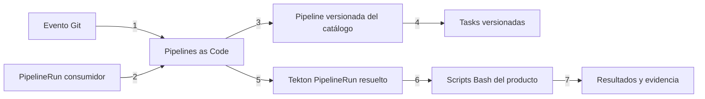

# EAC Pipeline Catalog

## 1. Propósito

Proporcionar pipelines reutilizables y versionadas para distintos tipos de
producto sin copiar la orquestación Tekton en cada repositorio.

El catálogo no sustituye los scripts del producto. Cada repositorio conserva
sus comandos Bash, reglas, código, pruebas y configuración. El catálogo solo
orquesta contratos conocidos.

## 2. Identidad y límites

| Elemento | Decisión |
|---|---|
| repositorio | `eac-pipeline-catalog` |
| entregable | catálogo Tekton versionado |
| versión inicial | `0.1.0` |
| propietario | EAC Platform |
| consumidores | componentes Platform, servicios y otros productos compatibles |
| excluido | lógica de negocio, instalación de terceros y secretos |

Una versión del catálogo contiene varios perfiles. No se crea un repositorio
por pipeline ni se publica un NuGet para envolver Tekton.

## 3. Modelo de reutilización



### Orden explicado

1. Un `push` o `pull_request` llega mediante la GitHub App.
2. Las anotaciones del `PipelineRun` seleccionan el evento y enlazan los datos
   del repositorio con parámetros de la Pipeline.
3. Pipelines as Code obtiene una Pipeline desde una versión inmutable del
   catálogo.
4. La Pipeline declara sus Tasks compartidas desde la misma versión.
5. Pipelines as Code genera una ejecución autocontenida y Tekton la procesa.
6. Cada Task invoca un script estable del repositorio consumidor.
7. Tekton registra estado, duración, logs y Results.

## 4. Plantilla, binding y trigger

| Concepto | Implementación |
|---|---|
| plantilla | `Pipeline` remota y versionada del catálogo |
| binding | parámetros y workspaces del `PipelineRun` consumidor |
| trigger | anotaciones `pipelinesascode.tekton.dev/on-event` y `on-target-branch` |
| ejecución | `PipelineRun` creado por Pipelines as Code |

No se añaden `EventListener`, `TriggerBinding` ni `TriggerTemplate` de Tekton
Triggers. Pipelines as Code ya recibe, valida y enlaza los eventos Git; usar
ambos mecanismos duplicaría webhooks, filtros y mantenimiento.

## 5. Estructura y perfiles

```text
catalog/
├── shared/
│   └── tasks/                         # comportamiento transversal real
└── profiles/
    ├── packages/
    │   ├── nuget/                     # implementado
    │   │   ├── tasks/
    │   │   └── pipelines/
    │   └── npm/                       # se crea al implementar el perfil
    ├── applications/
    │   └── angular/                   # se crea al implementar el perfil
    ├── services/
    │   └── dotnet/                    # se crea al implementar el perfil
    └── deployments/                   # se crea al implementar el perfil
```

La primera clasificación expresa la naturaleza del entregable: package,
aplicación, servicio o deployment. El segundo nivel identifica su formato o
tecnología. Las carpetas pendientes no se crean vacías.

| Perfil | Artefacto objetivo | CI | Release | Estado |
|---|---|---:|---:|---|
| `packages/nuget` | `.nupkg` y `.snupkg` | sí | planificado | CI implementada |
| `packages/npm` | paquete npm | planificado | planificado | pendiente |
| `applications/angular` | aplicación web estática o imagen OCI | planificado | planificado | pendiente |
| `services/dotnet` | imagen OCI de API, worker o gateway | planificado | planificado | pendiente |
| `deployments` | promoción por digest | no aplica | planificado | pendiente |

Los perfiles comparten Tasks únicamente cuando el comportamiento y el
contrato son idénticos. No se crea una pipeline universal con condicionales
para tecnologías diferentes.

## 6. Contrato `nuget-ci`

El repositorio consumidor debe exponer:

```text
scripts/
├── validate.sh
├── build.sh
├── test.sh
└── ci.sh
```

La Pipeline ejecuta:

```text
checkout → validate → build → test --no-build
```

| Parámetro | Uso |
|---|---|
| `repo-url` | repositorio que se debe obtener |
| `revision` | commit, tag o rama que se debe resolver |
| `configuration` | configuración .NET, `Release` por defecto |

El catálogo fija las imágenes de ejecución y la política de seguridad. El
repositorio mantiene el contenido de los scripts, por lo que puede evolucionar
sus reglas sin modificar la Pipeline compartida.

## 7. Versionado

- el catálogo usa SemVer;
- los consumidores fijan una etiqueta inmutable, por ejemplo `v0.1.0`;
- no se permiten referencias a `main`, `latest` ni tags móviles desde CI;
- una corrección compatible genera una nueva versión del catálogo;
- un cambio incompatible crea una nueva versión mayor del perfil;
- cada `PipelineRun` conserva la especificación resuelta para auditoría.

## 8. Modos de consumo

### Pipelines as Code

El consumidor conserva solo un archivo pequeño bajo `.tekton/`. Este contiene
el trigger, los parámetros dinámicos, el workspace y la referencia remota.

### Ejecución manual

`scripts/install.sh` aplica el catálogo seleccionado al namespace. Después se
puede iniciar la Pipeline con `tkn pipeline start`. Este modo permite pruebas
locales sin depender de un evento Git.

## 9. Seguridad

- las Tasks se ejecutan sin privilegios y eliminan capabilities Linux;
- CI no recibe credenciales de publicación;
- los parámetros no contienen secretos;
- las revisiones del catálogo son inmutables;
- los scripts del pull request se consideran código no confiable;
- release y deployment utilizarán Service Accounts distintas de CI.
